# 初见
也不是第一次使用koa了，脑子里提到koa，想到的就是非常多的插件，基本上开发过程中想得到的功能都能找到相关的包。还有一个概念就是洋葱圈模型，这个概念第一次接触还是从 [eggjs](https://eggjs.org/) 中知悉，不得不说 egg 文档写的真的好，知识点也很细，而且之前看[cnode](https://cnodejs.org/)有人评价过egg，很多人在使用koa最后实现的就是一个eggjs这样一个整合。

## 参考
- [阮一峰 - Koa 框架教程](https://www.ruanyifeng.com/blog/2017/08/koa.html)

## 概念
koa 是个非常简单好用的 web 框架，从github中看[koa](https://github.com/koajs/koa)仓库看到源代码确实很简短。

# Koa 基础
## HTTP 服务
巨简单
```js
// server.js

// 引入
const Koa = require('koa')
// 实例化
const app = new Koa();
// 监听端口
app.listen(3000);
```
运行：
```bash
$ node server.js
```
这样就实现了http服务，但是没有任何内容

## Context 对象
Koa 提供一个 Context 对象，表示一次对话的上下文（包括 HTTP 请求 (request) 和 HTTP 回复（response））。通过加工这个对象，就可以控制返回给用户的内容。  
[Context 对象源码地址](https://github.com/koajs/koa/blob/master/lib/context.js)  
首先这是 koa 实例的一个对象，可以在函数中通过参数访问，一般这个参数都用 ctx 来表示:
```js
// context.js
const Koa = require('koa');
const app = new Koa();

const main = ctx => {
  ctx.response.body = 'Hello World';
};

app.use(main);
app.listen(3000);
```
`ctx.response.body` 属性就是发送给用户的内容，上面代码通过 main 函数用来设置这个属性。使用 `app.use` 方法加载 `main` 函数。  
`ctx.response`代表 HTTP Response。`ctx.request`代表 HTTP Request。

## HTTP Rresponse 的类型
Koa 默认的返回类型是 `text/plain`，如果想返回其他类型的内容，可以用`ctx.request.accepts`判断一下，客户端希望接受什么数据（根据 HTTP Request 的 `Accept` 字段），然后使用 `ctx.response.type` **指定返回类型**。
```js
// accept.js

/* ... */
const main = ctx => {
  if (ctx.request.accepts('xml')) {
    ctx.response.type = 'xml';
    ctx.response.body = '<data>Hello World</data>';
  } else if (ctx.request.accepts('json')) {
    ctx.response.type = 'json';
    ctx.response.body = { data: 'Hello World' };
  } else if (ctx.request.accepts('html')) {
    ctx.response.type = 'html';
    ctx.response.body = '<p>Hello World</p>';
  } else {
    ctx.response.type = 'text';
    ctx.response.body = 'Hello World';
  }
};
/* ... */
```
上面就会显示一个xml文档

## 网页模板
直接看代码，koa的方法命名还是很好懂的：
```js
// templates/demo.html && template.js

const Koa = require('koa')

const app = new Koa();
const fs = require('fs');

const main = ctx => {
  ctx.response.type = 'html';
  ctx.response.body = fs.createReadStream('./templates/demo.html');
};

app.use(main);
app.listen(3000);
```

# 路由
## 原生路由
`ctx.request.path` 可以获取用户请求的路径，这样可以实现简单的路由：
```js
// route.js

/* ... */
const main = ctx => {
  if( ctx.request.path !== '/') {
    ctx.response.type = 'html';
    ctx.response.body = '<a href="/">Index Page</a>';
  } else {
    ctx.response.body = 'Hello World';
  }
}
/* ... */
```
## koa-route 模块
注意这里不是 `koa-router`，这是个官方模块，而 `koa-router` 是一个第三方的中间件
```js
// koa-route-demo.js

const route = require('koa-route');

const about = ctx => {
  ctx.response.type = 'html';
  ctx.response.body = '<a href="/">Index Page</a>';
};

const main = ctx => {
  ctx.response.body = 'Hello World';
};

app.use(route.get('/', main));
app.use(route.get('/about', about));
```
上面实现了`/`根路由和`/about`路由。

## 静态资源 `koa-static`
封装静态资源请求
```js
// koa-static-demo.js

/* ... */
const path = require('path');
const serve = require('koa-static');

const main = serve(path.join(__dirname));
app.use(main);
/* ... */
```
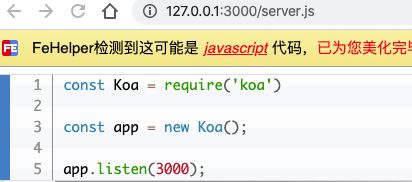  
效果如图，我们访问第一个示例作为静态资源访问。

## 重定向 redirect
很多场景需要用到重定向，比如用户登录。  
`ctx.response.redirect()` 方法可以发出一个 302 跳转，将用户导向另一个路由。
```js
// redirect.js
/* ... */
const redirect = ctx => {
  ctx.response.redirect('/');
  ctx.response.body = '<a href="/">Index Page</a>';
}

app.use(route.get('/redirect', redirect));
/* ... */
```
上面定义了，如果访问`/redirect`,将会重定向到`/`，关键代码就是`ctx.response.redirect('/')`

# 中间件
## Logger 功能
Koa 最大的一个特色，最重要的一个设计就是中间件（middleware）。实现一个 Logger（打印日志）功能：
```js
// logger.js
/* ... */
const main = ctx => {
  console.log(`${Date.now()} ${ctx.request.method} ${ctx.request.url}`);
  ctx.response.body = 'Hello World';
}
/* ... */
```
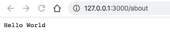
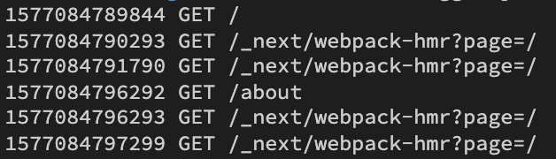  
这样命令行便会显示我们定义的需要打印的日志内容。

## 中间件的概念
上面的 Logger 功能可以拆分成一个独立函数。
```js
// logger-middleware.js
/* ... */
const logger = (ctx, next) => {
  console.log(`${Date.now()} ${ctx.request.method} ${ctx.request.url}`);
  next();
}
app.use(logger);
/* ... */
```
实现的效果和上面类似，其实上面的`main`也算是一个中间件，注意这里的`logger`中间件接受了两个参数，一个是 `ctx`（Context 对象）,一个是`next`（是一个函数`next()`，将执行权转角给下一个中间件，也是实现洋葱圈模型的关键之一），

## 中间件栈
多个中间件会形成一个栈结构（middle stack）,以**“先进后出”（first-last-out）**的顺序执行。
1. 最外层的中间件首先执行。
2. 调用 next 函数，把执行权交给下一个中间件。
3. ...
4. 最内层中间件最后执行
5. 执行结束后，把执行权交回上一层的中间件。
6. ...
7. 最外层的中间件收回执行权后，执行 next 函数后面的代码（指写在 `next()` 下面的代码）
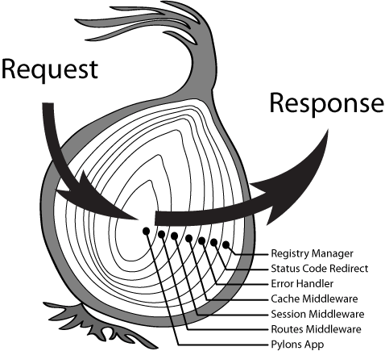  
就像一个洋葱一样，从洋葱的左边进去，从洋葱的右边出来，最外层是第一层，由外到内再到外。
```js
// middle-stack.js
/* ... */
const one = (ctx, next) => {
  console.log('>> one');
  next();
  console.log('<< one');
}

const two = (ctx, next) => {
  console.log('>> two');
  next(); 
  console.log('<< two');
}

const three = (ctx, next) => {
  console.log('>> three');
  next();
  console.log('<< three');
}

app.use(one);
app.use(two);
app.use(three);

/* ... */
```
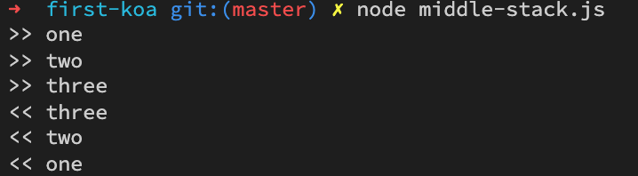  
如果没有 `next`函数，那么执行权就不会传递下去

## 异步中间件
异步操作，例如读取数据库，中间件就必须写成 async 函数。
```js
// async-middleware.js
const fs = require('fs.promised');
const Koa = require('koa');
const app = new Koa();

const main = async function (ctx, next) {
  ctx.response.type = 'html';
  ctx.response.body = await fs.readFile('./templates/demo.html', 'utf8');
};

app.use(main);
app.listen(3000);
```
上面代码中，`fs.readFile`是一个异步操作，必须写成`await fs.readFile()`，然后中间件必须写成 `async` 函数。  
注意这个`fa.promised`需要额外安装，我们异步读取了模板的内容。

## 中间件合成
`koa-compose` 模块可以将多个中间件合成为一个。
```js
// compose.js
/* ... */
const compose = require('koa-compose');

const logger = (ctx, next) => {
  console.log(`${Date.now()} ${ctx.request.method} ${ctx.request.url}`);
  next();
}

const main = ctx => {
  ctx.response.body = 'Hello World';
};

const middlewares = compose([logger, main]);
app.use(middlewares);
/* ... */
```

# 错误处理
## 500 错误
Koa 提供 `ctx.throw()` 方法，用来抛出错误，`ctx.throw(500)` 就是抛出 500 错误：
```js
// 500.js
/* ... */
const main = ctx => {
  ctx.throw(500);
};
/* ... */
```
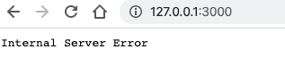  
命令行也会有响应的报错日志
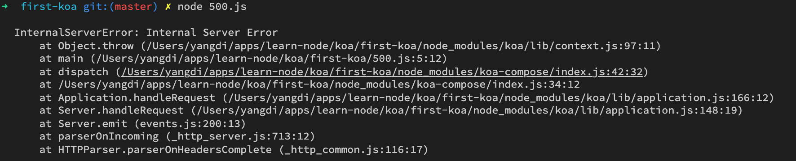

## 404 错误
将 `ctx.response.status` 设置成 404，就相当于 `ctx.throw(404)`，返回 404 错误。一般服务器响应错误还是用`ctx.throw()`。
```js
// 404.js
/* ... */
const main = ctx => {
  ctx.response.status = 404;
  ctx.response.body = 'Page Not Found';
};
/* ... */
```


## 处理错误的中间件
为了方便处理错误，最好用 `try...catch` 将其捕获。但是，为每个中间件都写`try...catch`太麻烦，这就可以让最外层的中间件负责所有中间件的错误处理。
```js
// catch.js
/* ... */
const handler = async (ctx, next) => {
  try {
    await next();
  } catch (err) {
    ctx.response.status = err.statusCode || err.status || 500;
    ctx.response.body = {
      message: err.message
    };
  }
};

const main = ctx => {
  ctx.throw(500);
};

// 放在第一个
app.use(handler);
app.use(main);
/* ... */
```
因为 `main` 中间件报了一个 500 错误，所以如下
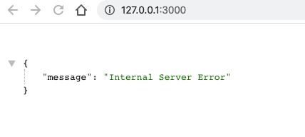

## error 事件的监听
运行过程中一旦出错，Koa 会触发一个 `error` 事件。监听这个事件，也可以处理错误。
```js
// error.js
/* ... */
const main = ctx => {
  ctx.throw(500);
};

app.on('error', (err, ctx) =>
  console.error('server error', err)
);
/* ... */
```
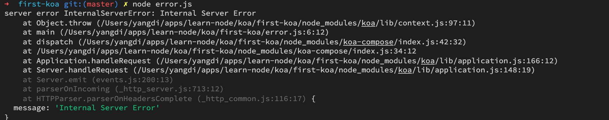

## 释放 error 事件
如果错误被`try...catch`捕获，就不会触发 `error` 事件，这时，必须调用`ctx.app.emit()`，手动释放`error`事件，才能让监听函数生效。
```js
// error-emit.js
/* ... */
const handler = async (ctx, next) => {
  try {
    await next();
  } catch (err) {
    ctx.response.status = err.statusCode || err.status || 500;
    ctx.response.type = 'html';
    ctx.response.body = '<p>Something wrong, please contact administrator.</p>';
    ctx.app.emit('error', err, ctx);
  }
};

const main = ctx => {
  ctx.throw(500);
};

app.on('error', function(err) {
  console.log('logging error ', err.message);
  console.log(err);
});
/* ... */
```
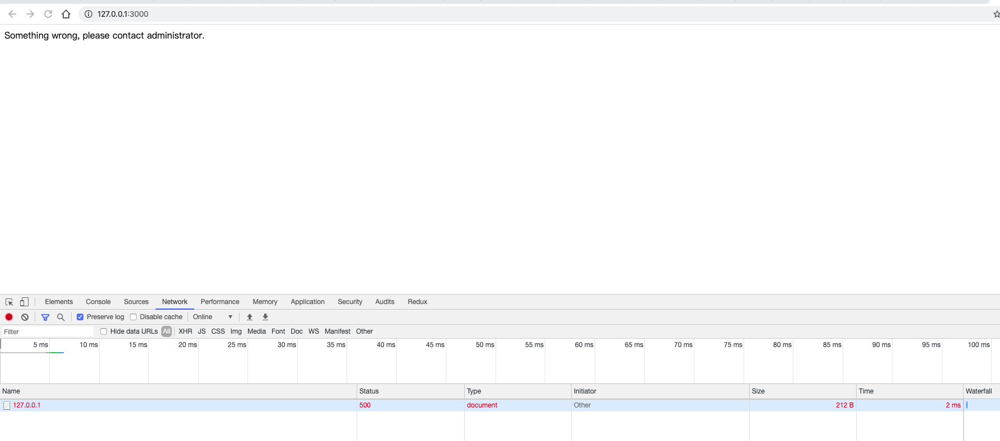
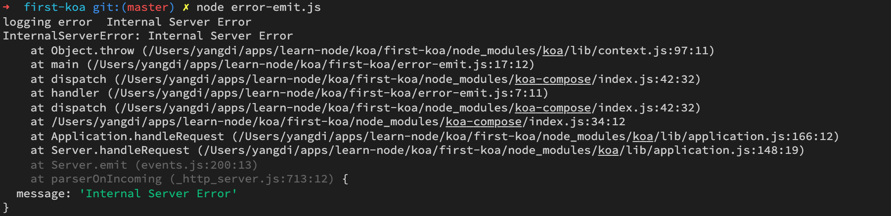  
上面代码中，`main`函数抛出错误，被`handler`函数捕获。`catch`代码块里面使用`ctx.app.emit()`手动释放`error`事件，才能让监听函数监听到。

# Web App 的功能
## Cookies
ctx.cookies 用来读写 Cookie
```js
// cookie.js
/* ... */
const main = function(ctx) {
  const n = Number(ctx.cookies.get('view') || 0) + 1;
  ctx.cookies.set('view', n);
  ctx.response.body = n + ' views';
}
/* ... */
```
这样就实现了一个存储在cookie里的数字，随着页面刷新每次+1
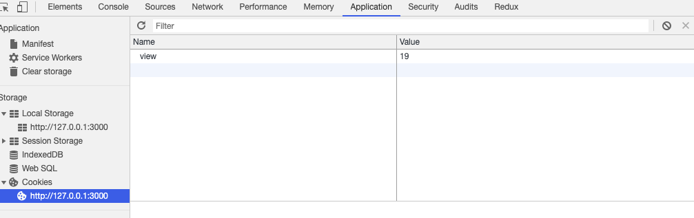

## 表单
Web 应用离不开处理表单。本质上，表单就是`POST`方法发送到服务器的键值对。`koa-body`模块可以用来 POST 请求的数据体里面提取键值对。
```js
// koa-body-demo.js

/* ... */
const koaBody = require('koa-body');

const main = async function(ctx) {
  const body = ctx.request.body;
  if(!body.name) ctx.throw(400, '.name required');
  ctx.body = { name: body.name }
}
app.use(koaBody());
/* ... */
```
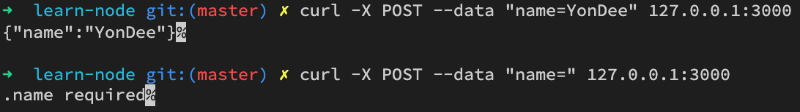  
用POST方法向服务器发送一个键值对，正确就正常解析，不正确就会收到错误提示。

## 文件上传
`koa-body` 模块还可以用来处理文件上传。
```js
// upload.js
/* ... */
const os = require('os');
const path = require('path');
const koaBody = require('koa-body');

const main = async function(ctx) {
  const tmpdir = os.tmpdir();
  const filePaths = [];
  const files = ctx.request.files || {};

  for (let key in files) {
    const file = files[key];
    const filePath = path.join(tmpdir, file.name);
    const reader = fs.createReadStream(file.path);
    const writer = fs.createWriteStream(filePath);
    reader.pipe(writer);
    filePaths.push(filePath);
  }

  ctx.body = filePaths;
};

app.use(koaBody({ multipart: true }));
/* ... */
```